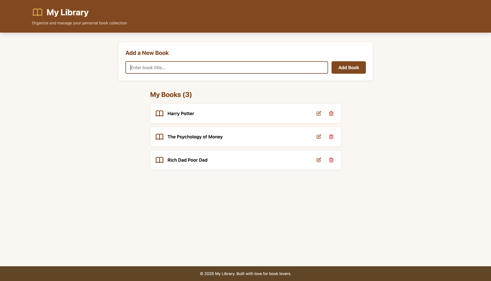
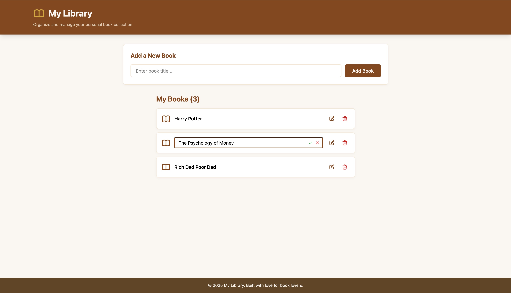

# My Library - Personal Book Collection Manager

A modern, elegant book library application built with React 19 and Tailwind CSS. This project demonstrates clean component architecture, state management patterns, and thoughtful UI/UX design with a beautiful library-themed aesthetic.

## 📸 Screenshots

### Main Interface


_Clean, intuitive interface for managing your book collection_

### Edit Mode


_Seamless inline editing with save/cancel actions_

## ✨ Features

### Core Functionality

- **Add Books** - Quick book entry with a streamlined form
- **Edit Books** - Inline editing with intuitive save/cancel controls
- **Delete Books** - One-click book removal with icon buttons
- **Real-time Updates** - Instant UI updates using React state management
- **Book Count Display** - Live count of books in your collection

### UI/UX Highlights

- **Library-Themed Design** - Warm wood tones, parchment backgrounds, and gold accents
- **Responsive Layout** - Works seamlessly on desktop and mobile devices
- **Hover Effects** - Subtle interactions for better user experience
- **Icon-Based Actions** - Clean, modern icons for edit and delete operations
- **Compact Inline Editing** - Edit books without leaving the list view
- **Auto-focus** - Input fields auto-focus for quick data entry

## 🛠️ Tech Stack

### Frontend

- **React 19** - Latest React with hooks and modern patterns
- **Tailwind CSS v4** - Utility-first CSS with custom design system
- **Vite** - Lightning-fast build tool and dev server
- **JavaScript ES6+** - Modern JavaScript features

### Development Tools

- **ESLint** - Code linting with React-specific rules
- **Vite Plugin React** - Fast Refresh and JSX support
- **Custom Vite Configuration** - Treats `.js` files as JSX automatically

### Ready for Integration

- **Axios** - Installed for future API integration
- **JSON Server** - Installed for mock backend development

## 🏗️ Architecture

### Component Structure

```
App (Root)
├── BookCreate - Form component for adding new books
└── BookList - Container for book collection
    └── BookShow - Individual book card
        └── BookEdit - Inline edit form with save/cancel
```

### State Management

- **Local State** - Uses React `useState` for simple, predictable state management
- **Props Drilling** - Clear parent-to-child data flow
- **Event Handlers** - Callback props for child-to-parent communication

### Design System

Custom Tailwind theme with library-inspired colors:

- **Primary Colors** - Warm wood tones (saddle brown, chocolate)
- **Accent Colors** - Gold highlights and burgundy accents
- **Backgrounds** - Parchment and cream tones
- **Typography** - Playfair Display for headings, Inter for body text

## 🚀 Getting Started

### Prerequisites

- Node.js (v16 or higher)
- npm or yarn

### Installation

1. **Clone the repository**

   ```bash
   git clone <repository-url>
   cd books
   ```

2. **Install dependencies**

   ```bash
   npm install
   ```

3. **Start the development server**

   ```bash
   npm start
   ```

4. **Open your browser**
   Navigate to [http://localhost:3000](http://localhost:3000)

### Available Scripts

| Command           | Description                                   |
| ----------------- | --------------------------------------------- |
| `npm start`       | Runs the app in development mode on port 3000 |
| `npm run build`   | Creates an optimized production build         |
| `npm run lint`    | Runs ESLint to check code quality             |
| `npm run preview` | Preview the production build locally          |

## 💡 Key Implementation Details

### Inline Edit Pattern

Books can be edited inline without navigation:

- Click edit icon to toggle edit mode
- Input field with embedded save/cancel buttons
- ESC key support for quick cancellation (can be added)
- Auto-focus on edit activation
